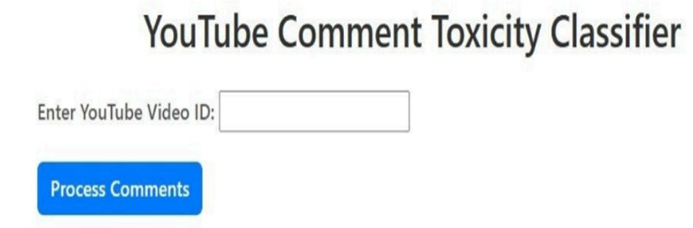
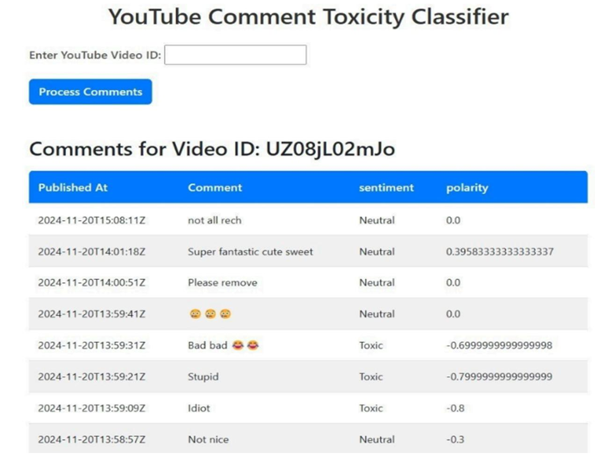

# Toxic Comment Classification Using ML

## Project Preview

### Input Page

### Output Page

---

## Overview

Toxic Comment Classification Using ML is an AI-powered NLP application developed to detect and classify toxic YouTube comments using machine learning and sentiment analysis techniques.

The system analyzes user comments in real-time using YouTube API integration and classifies comments as Toxic, Neutral, or Non-Toxic based on sentiment polarity. The project focuses on improving online communication safety and content moderation using AI-driven text analysis.

---

## Features

* YouTube comment extraction
* Real-time sentiment analysis
* Toxic comment detection
* Polarity score calculation
* Flask-based web interface
* User-friendly dashboard
* AI-assisted text classification

---

## Technologies Used

* Python
* Flask
* TextBlob
* YouTube Data API
* HTML
* CSS
* Bootstrap

---

## Project Structure

* `app.py` → Main Flask backend application
* `templates/` → Frontend HTML files
* `static/` → CSS files and screenshots
* `architecture/` → System architecture and UML diagrams
* `documentation/` → Project documentation and report
* `ppt/` → Project presentation

---

## Applications

* Social media moderation
* Toxic content filtering
* AI-based sentiment analysis
* Online community management
* Smart content monitoring systems

---

## Architecture and UML Diagrams

The `architecture/` folder contains:

* System Architecture Diagram
* Technical Architecture Diagram
* Use Case Diagram
* Activity Diagram
* Class Diagram
* Sequence Diagram

These diagrams represent the workflow, backend processing, API integration, and toxic comment classification pipeline.

---

## Note

The documentation and presentation files contain simplified pseudo code representations for academic explanation purposes, while this repository includes the complete working implementation code with updated logic, UI improvements, and backend enhancements.

---

## Future Improvements

* Deep learning-based toxicity detection
* Multilingual comment analysis
* Advanced NLP models
* Real-time moderation dashboard
* Cloud deployment integration

---

## Developer

Harshitha Algubelli & Team

B.Tech – Computer Science (AI & ML)
